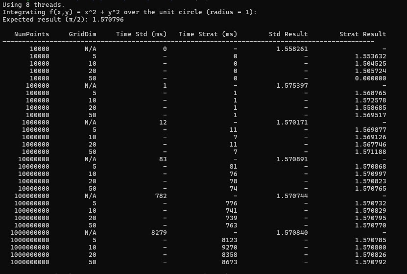
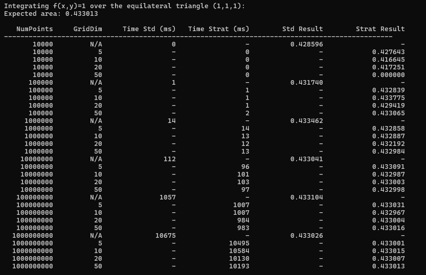
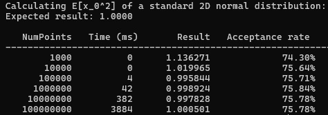
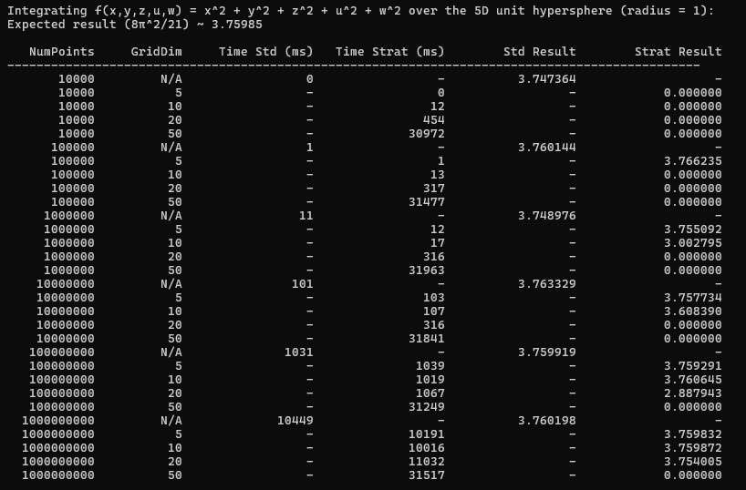
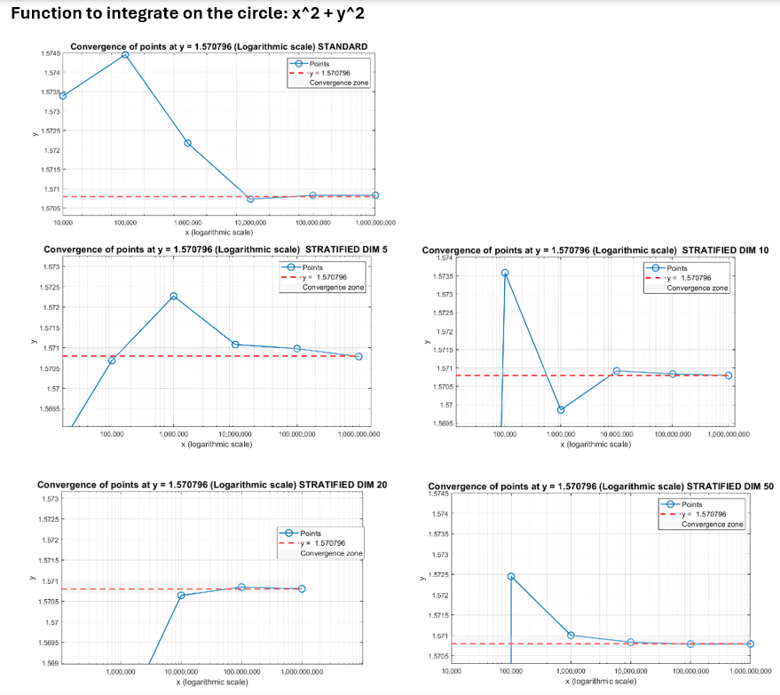
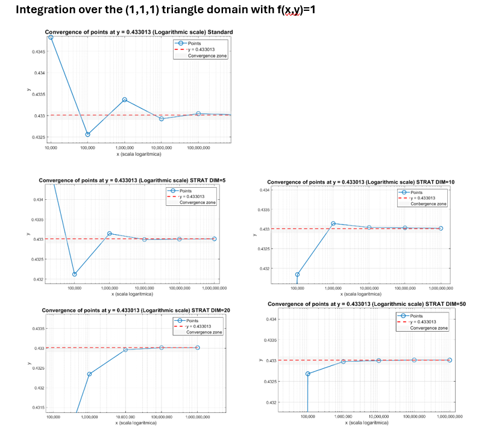
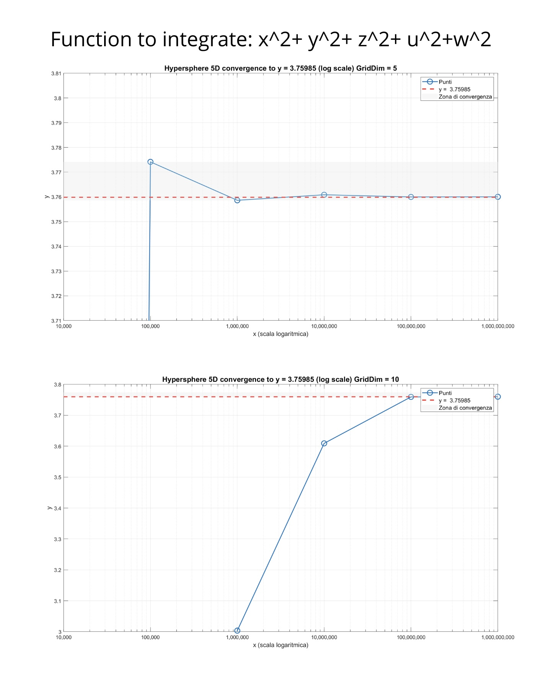
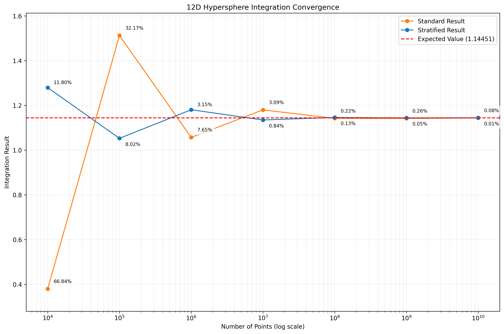
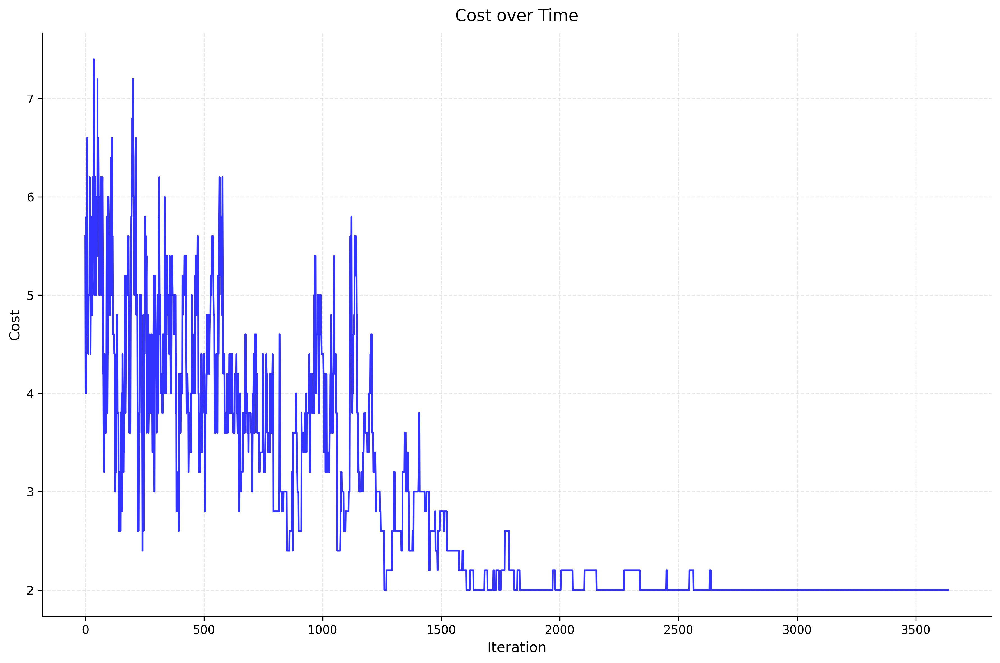
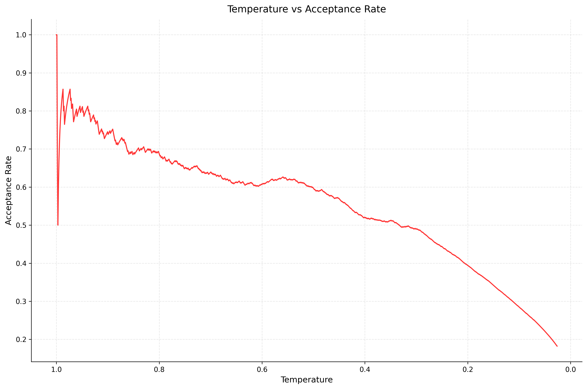

# Monte Carlo Integration

This project demonstrates parallel numerical integration of functions over various geometric domains using Monte Carlo
methods. It includes implementations of standard Monte Carlo integration, stratified sampling, and Metropolis-Hastings
sampling.

## Presentation

https://docs.google.com/presentation/d/1e6osA3i9tdfO_xjJVU_0gRxj43x0pYEDDTybEYEgxOs

## Understanding Monte Carlo Integration

Monte Carlo integration is a technique for approximating integrals by using random samples. Instead of analytically
computing the integral, we estimate it by drawing random points uniformly from the domain and evaluating the integrand
at these points. As the number of samples increases, the approximation typically converges to the true value of the
integral.

The basic formula for Monte Carlo integration is:

$$\int_{\Omega} f(x)\ dx \simeq \frac{|\Omega|}{n} \sum_{i=0}^{n-1} f(x_i)$$

- $\Omega$ is the domain over which we integrate.
- $f(x)$ is the function to be integrated.
- $|\Omega|$ denotes the measure (volume, area, length) of the domain.
- $x_i$ are points sampled uniformly at random from $\Omega$.
- $n$ is the number of sample points.

The accuracy of the Monte Carlo approximation improves with the number of samples, and various variance-reduction
techniques (such as stratified sampling) can be applied.

## Sampling Methods

### Standard Monte Carlo (Uniform Sampling)

In standard Monte Carlo integration, we:

1. Determine a bounding region that contains the entire domain $\Omega$.
2. Draw points uniformly at random from this bounding region.
3. Evaluate $f$ at each point. If a point falls outside $\Omega$, its contribution is zero.
4. Average these values and multiply by the measure of the bounding region.

This approach is straightforward but may have high variance, especially if $\Omega$ is complex or if $f$ varies
significantly within the domain. Uniform sampling does not focus on any particular region of the domain and treats all
areas equally, which can lead to inefficient sampling, particularly in higher dimensions or for irregular shapes.

### Stratified Sampling

Stratified sampling reduces variance by partitioning the bounding region into smaller, non-overlapping subregions
(strata) and sampling from each one. By ensuring that every stratum is represented in the sample set, this method:

1. Provides a more uniform coverage of the domain.
2. Reduces the likelihood of clustering samples in just a few areas.
3. Improves the accuracy of the integral estimate with fewer samples compared to plain uniform sampling.

In practice, you divide each dimension into several intervals to form a grid of strata. For each stratum, you then take
multiple random points. The result is then a weighted average of all strata. Since each subregion is sampled, the
overall estimate tends to have lower variance, making stratified sampling more efficient and often more accurate for
the same number of samples.

### Metropolis-Hastings (MCMC)

Metropolis-Hastings algorithm for sampling from a complex probability distribution $p(x)$
and computing expectations $E[h(x)]$ with respect to this distribution.

How does it work:

- choose a starting point $x_0$
- define a proposal distribution $Q(x'|x)$ (here: Gaussian is centered at current point)
- generate new candidate point $x'$ from $Q(x'|x)$
- compute acceptance ratio $r = p(x')/p(x)$
- accept $x'$ with probability $min(1,r)$
- for accepted points, accumulate $h(x)$ to compute $E[h(x)]$
- repeat

The algorithm will generate samples distributed according to $p(x)$,
which lets us compute $E[h(x)]$ = $\int h(x)p(x)dx / \int p(x)dx$.

To parallelize: run multiple independent chains and average their results.

## Features

- **Parallel Implementation**:
    - The integration process is parallelized by splitting the total number of samples across multiple threads.
    - Each thread independently generates and evaluates its own subset of points and accumulates partial sums.
    - After all threads finish, their partial sums are combined (reduced) to produce the final integral estimate. This
      uses multiple threads to speed up the computation.
    - Each thread has its own local generator, which are seeded with `std::seed_seq`, which itself is created with
      random values from `std::random_device`:

```c++
    // Initializes pseudo-random engines with seeds from std::seed_seq
    void initializeEngines(size_t numThreads) {
        std::random_device rd;
        std::vector<std::uint32_t> entropy;
        entropy.reserve(numThreads);

        for (size_t i = 0; i < numThreads; ++i) {
            entropy.push_back(rd());
        }

        std::seed_seq seq(entropy.begin(), entropy.end());
        std::vector<std::uint32_t> seeds(numThreads);
        seq.generate(seeds.begin(), seeds.end());

        engines.clear();
        for (auto seed: seeds) {
            engines.emplace_back(seed);
        }
    }
```

- **Multiple Integration Domains**:
    - **Hypersphere**: A hypersphere of arbitrary dimension and radius, bounded by a hypercube.
    - **Polygon2D**: A polygon in 2D, defined by a set of vertices.
    - **Polytope** (V-form): A polytope defined as the convex hull of a finite set of vertices  $V = \{ v_1, v_2, …, v_m \}$  in $\mathbb{R}^n$. This representation describes the polytope as the smallest convex set containing all given points. The decomposition process involves partitioning the polytope into n-simplexes, each defined by a subset of  n+1  affinely independent vertices.

## Directory Structure

- **`domain/`**: Contains classes representing geometric domains (`Hypersphere`, `Polygon2D`, `Polytope`) and the
  `IntegrationDomain` interface they all implement.
- **`integrators/`**: Contains an abstract `AbstractIntegrator` which handles parallel random number generation and also
   the integration strategies: `MonteCarloIntegrator` for standard and stratified sampling,
  `MetropolisHastingsIntegrator` for MH-sampling and `MetropolisHastingsIsing` for the ising model implementation of MH.
- **`main.cpp`**.
- **`benchmarks`**: Demonstrates integrating different functions over different domains.
- **`ising_model`**: Example implementation of the 2d ising model.
- **`room_assignment`**: Example implementation of the room assignment problem.

## Dependencies

- **C++17** or later:
- **CMake**: For building the project.
- **Eigen**: A C++ template library for linear algebra.

## Building and running the project

1. Ensure you have CMake and C++17 or newer installed.
2. Clone the repository:
   ```bash
   git clone git@github.com:AMSC-24-25/09-mc-09-mc.git
   mv 09-mc-09-mc 09-mc
   cd 09-mc
   ```
3. Create a build directory and run CMake:
   ```bash
    mkdir build && cd build
    cmake ..
    make
   ```
4. Run:
    ```bash
    ./09-mc
    ```

## Integrators and domains testing

- Integrating `f(x,y) = x² + y²` over a unit circle, displaying results from standard and stratified sampling (using different grid sizes)
  for various numbers of points.
- Integrating `f(x,y) = 1` over an equilateral triangle (using `Polygon2D`) to find its area 
  and print a similar comparison table.
- Calculates $E[x^2]$ of a standard 2D normal distribution using Metropolis-Hastings method of random chains.
- Integrating `f(x,y,z,u,w) = x² + y² + z² + u² + w² `over the 5d unit hyperphere (radius =1)
- Integrating `f(x) = ` $\sum_{i=0}^{11} x_i^2$ over the 12d unit hyperphere (radius =1)







- These graphs show the convergence of the Monte Carlo integral with different stratification strategies.
  It is observed that stratification accelerates convergence, but if the subdivision is excessive, the results worsen due to the scarcity of points per layer









## Performances

By setting the number of threads to 1, we establish a baseline for sequential execution.

This baseline enables us to calculate the speedup achieved in different scenarios (standard and stratified) when multiple threads are utilized. 
The speedup metric helps to quantify the performance gain provided by parallel processing.


## 2D Ising Model

The 2D Ising model is a tool used to simulate the behavior of magnetic materials and phase transitions. It operates on a square lattice grid, where each intersection point—or lattice site—carries a spin that can be in one of two states: up (+1) or down (−1).

Estimating quantities like the specific heat per particle involves integrating over all possible configurations of the system. However, it's difficult to sample from the probability distribution over the possible states of the system. To overcome this, we employ a modified Metropolis-Hastings algorithm, with the following key adaptations:

- **Square Lattice Domain**: the simulation is conducted on a two-dimensional square lattice, reflecting the geometric structure of the material being modeled.

- **Local Spin Updates**: at each step, a lattice site is randomly selected, and its spin is flipped to propose a new state. This local update mechanism allows the system to explore the configuration space efficiently.

- **Energy-Based Acceptance Criterion**: determined by a target distribution derived from the system's energy function. Specifically, $A = \min\left(1, e^{-\Delta E / k_B T}\right)$, where Δ𝐸 is the change in energy resulting from the spin flip, $𝑘_𝐵$ is Boltzmann's constant, and 𝑇 is the temperature.

The expected value of the energy, $\langle E \rangle$, which is an integral over all possible states of the system, is effectively approximated by averaging the energies of these sampled configurations.

The specific heat per particle, $𝐶_𝑣$, can be determined by examining how $\langle E \rangle$ changes with temperature:

$$C_v = \frac{\partial \langle E \rangle}{\partial T}$$

This expression highlights how fluctuations become significant near critical points. Analyzing $𝐶_𝑣$ allows us to investigate phase transitions, such as the shift from ordered (magnetized) to disordered (non-magnetized) states as temperature varies.

### Example implementation

The following values used in the example execution of the algorithm can be changed as needed based on the problem addressed and what we want to investigate.

- T is set to 4.5 degrees. Consider exploring the 2.5-4.5 range to observe the behavior of the 2d system near the critical point.
- The number of points is set to a sufficiently large value but can be changed based on the size of the lattice and other specs.
- Lattice size is currently set to 20x20.
- Increment used to calculate the derivative is set to 0.1.

## Room Assignment using Simulated Annealing

### The Problem

The room assignment problem involves assigning n college freshmen to n/2 rooms while minimizing potential interpersonal
conflicts. Each student has completed a survey indicating their compatibility with others, resulting in a "dislike
matrix" where higher values indicate greater potential for conflict between pairs of students.

### Method: Simulated Annealing

Simulated annealing is a probabilistic optimization technique inspired by the physical process of annealing in
metallurgy. Here's how it works:

1. **Physical Analogy**:
    - In metallurgy, annealing involves heating a metal to a high temperature and then cooling it slowly
    - The high temperature allows atoms to move freely and escape local energy minima
    - Slow cooling helps the material reach a low-energy crystalline state

2. **Algorithm Components**:
    - **State**: Current room assignments for all students
    - **Energy**: Total sum of dislike values between roommates
    - **Temperature**: Controls the probability of accepting worse solutions
    - **Cooling Schedule**: How temperature decreases over time

3. **Process**:
    - Start with random room assignments
    - Repeatedly:
        - Select two students randomly
        - Try swapping their room assignments
        - Accept if it improves the situation (reduces total dislikes)
        - Sometimes accept worse arrangements (based on temperature)
        - Gradually reduce temperature

### Implementation Details

#### Key Classes and Functions

1. **RoomAssignment Class**:
   ```cpp
   class RoomAssignment {
       int n;  // number of students
       vector<vector<double>> dislikes;  // dislike matrix
       vector<int> assignments;  // room assignments
   };
   ```

2. **Core Methods**:
    - `calculateTotalDislikes()`: Computes current solution cost
    - `selectRandomStudents()`: Chooses students for potential swap
    - `solve()`: Implements the simulated annealing algorithm

#### Important Implementation Features

1. **Temperature Schedule**:
    - Initial temperature $T_0 = 1.0$
    - Geometric cooling: $T_{i+1} = 0.999 \cdot T_i$
    - Minimum temperature = $0.01$

2. **Acceptance Probability**:
    - For a cost change $Δ$ at temperature $T$
    - Accept if $Δ < 0$ (improvement)
    - Accept with probability $e^{-Δ/T}$ otherwise

3. **Termination Conditions**:
    - Maximum 1000 iterations without improvement
    - Temperature drops below minimum

### Example Usage

```cpp
// Create dislike matrix
vector<vector<double>> dislikes = {
    {0.0, 0.8, 0.4},
    {0.8, 0.0, 0.3},
    {0.4, 0.3, 0.0}
};

// Initialize solver
RoomAssignment solver(6, dislikes);

// Run optimization
solver.solve();
```

### Visualization 



